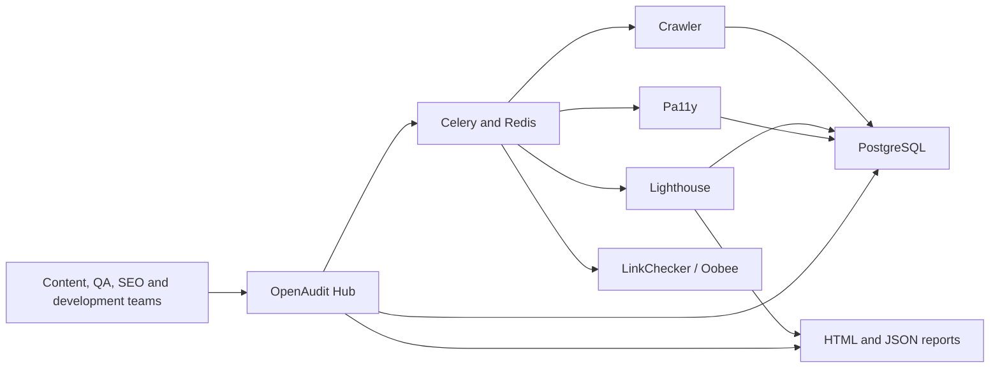
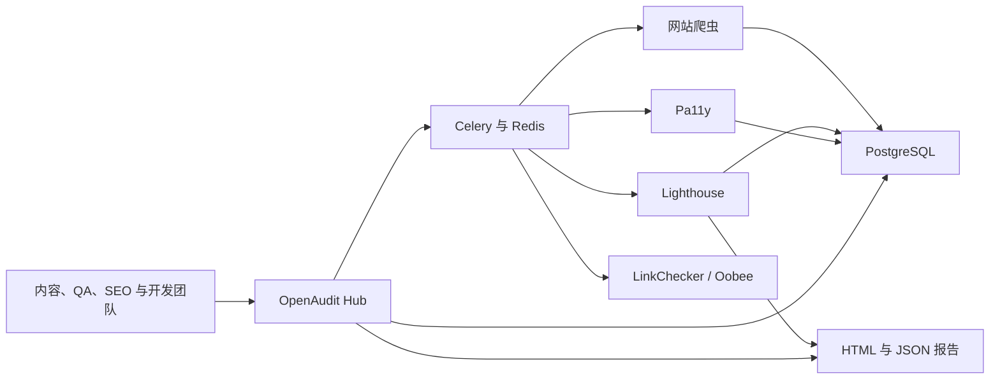

# OpenAudit Hub

[](https://github.com/kate666kate/openaudit-hub/actions/workflows/ci.yml)
[](LICENSE)

**Open-source website governance for accessibility, SEO, quality assurance, and performance.**

**面向无障碍、SEO、质量保证与性能管理的开源网站治理平台。**

[English](#english) | [简体中文](#简体中文)

OpenAudit Hub combines proven open-source scanners with one operational dashboard. It is designed for teams that need a self-hosted, transparent alternative to commercial website-governance platforms such as Siteimprove.

OpenAudit Hub 将成熟的开源扫描工具整合到统一的管理平台中，适合需要自行部署、数据透明，并希望替代 Siteimprove 等商业网站治理平台的团队。

---

## English

### What OpenAudit does

- Manages multiple websites from one dashboard.
- Crawls sitemaps and same-domain internal links.
- Runs Lighthouse audits for performance, SEO, accessibility, and best practices.
- Runs Pa11y WCAG checks with selectors, HTML evidence, and practical remediation guidance.
- Builds a whole-site content index and detects missing, duplicated, short, or oversized metadata, H1 problems, thin pages, and missing language declarations.
- Audits canonical URLs, robots directives, sitemap/indexing conflicts, hreflang, JSON-LD, Open Graph metadata, and HTTP security headers across the crawled site.
- Detects broken links and keeps a page inventory.
- Searches the selected website's crawled pages and opens an internal Page Inspector with status, findings, selectors, and HTML evidence.
- Tracks findings through open, assigned, in-progress, resolved, ignored, and reopened states.
- Schedules long-running scans with Celery and Redis instead of blocking web requests.
- Stores websites, scan jobs, crawl data, and issue history in PostgreSQL.
- Extracts content keywords with YAKE and optionally enriches them with Google Search Console CSV data.
- Retains native Lighthouse HTML/JSON reports and historical score trends.

### Open-source components

| Component | Purpose |
| --- | --- |
| OpenAudit Hub | Unified dashboard, website management, issues, guidance, and trends |
| Lighthouse / Lighthouse CI | Performance, SEO, accessibility, and best-practice audits |
| Pa11y / Pa11y Dashboard | WCAG accessibility testing and monitoring |
| Oobee (formerly Purple A11y) | Deep, crawl-based accessibility audits |
| LinkChecker | Broken-link validation |
| PostgreSQL | Operational and historical data |
| Redis + Celery | Background jobs and scheduled scans |
| YAKE | Local keyword extraction |
| Matomo / Mautic | Optional analytics and marketing integrations |

### Architecture



### Quick start

Requirements: Docker Desktop with Docker Compose and PowerShell on Windows.

1. Create your local configuration:

```powershell
Copy-Item .env.example .env
```

2. Replace the example passwords and tokens in `.env` before exposing the services beyond your computer.

3. Build and start the core platform:

```powershell
docker compose up -d --build postgres redis portal scan-worker scan-scheduler
```

4. Open the dashboard:

```text
http://localhost:9090
```

Operational health endpoints:

- Liveness: `http://localhost:9090/health/live`
- Readiness, including the database check: `http://localhost:9090/health/ready`

Optional standalone tools:

```powershell
docker compose up -d --build mongo pa11y-dashboard lhci-server lhci-scheduler
```

- Pa11y Dashboard: `http://localhost:4000`
- Lighthouse CI: `http://localhost:9001`

### Add websites and run scans

Use the web interface instead of editing configuration files:

1. Open `http://localhost:9090/websites`.
2. Add a website name and base URL.
3. Set its page limit, exclusions, schedule, and enabled state.
4. Open `http://localhost:9090/scans`.
5. Choose a website and scan mode, then start the scan.

Available modes:

- **Full audit:** crawl, Lighthouse, and Pa11y.
- **Accessibility:** crawl and Pa11y.
- **Content quality:** crawl, index page content, and run whole-site editorial checks.
- **Lighthouse only:** crawl and Lighthouse.

Lighthouse uses deterministic smart sampling instead of simply taking the first URLs found. It selects the homepage and representative pages from distinct route groups such as `/products/:page` and `/blog/:page`, then fills remaining capacity in round-robin order. The default is 10 representative pages with 2 concurrent Lighthouse processes. Configure `LIGHTHOUSE_PAGE_LIMIT` and `LIGHTHOUSE_CONCURRENCY` as needed. Every run writes a `scan-manifest-*.json` report showing all selected URLs and route groups.

Each website also has configurable quality budgets for Performance, Accessibility, SEO, LCP, and CLS. Edit them on the Websites page and review results under **Quality Assurance > Performance budgets**. Lighthouse and Full scans create managed budget issues when a representative page misses a target, and later scans resolve those issues automatically after the page returns within budget.

The worker discovers sitemap and internal pages, stores the page inventory, runs the selected tools, merges repeated findings, and reconciles issue status without mixing results from different websites.

### Reports and operational views

For a short interview walkthrough, use [`docs/interview-demo-checklist.md`](docs/interview-demo-checklist.md).

| View | URL |
| --- | --- |
| Dashboard | `http://localhost:9090/` |
| Websites | `http://localhost:9090/websites` |
| Scans | `http://localhost:9090/scans` |
| Issues | `http://localhost:9090/modules/issues` |
| Crawled pages | `http://localhost:9090/modules/pages` |
| Broken links | `http://localhost:9090/modules/broken-links` |
| Activity plans | `http://localhost:9090/modules/activity-plans` |
| Content optimization | `http://localhost:9090/modules/content-optimization` |
| Duplicate content | `http://localhost:9090/modules/duplicate-content` |
| Keyword suggestions | `http://localhost:9090/modules/keyword-suggestions` |
| Shopify readiness | `http://localhost:9090/modules/ecommerce-readiness` |
| Conversion tracking | `http://localhost:9090/modules/conversion-tracking` |
| WordPress readiness | `http://localhost:9090/modules/wordpress-readiness` |
| WordPress launch checklist | `http://localhost:9090/modules/wordpress-launch-checklist` |
| Robots and indexing | `http://localhost:9090/modules/robots-indexing` |
| Structured data | `http://localhost:9090/modules/structured-data` |
| Security headers | `http://localhost:9090/modules/security-headers` |

Native Lighthouse HTML and JSON files are written to `outputs/reports/`. The dashboard uses the JSON reports to show latest scores, previous scores, category trends, and regressions.

### Content optimization and duplicates

Run a **Content** or **Full** scan to populate the crawl inventory. Content optimization checks title and Meta length, H1 count, and measured word count, then provides page-level fixes. Duplicate content groups repeated titles, Meta descriptions, exact body copies, and near-duplicate body content across the selected website. Each group recommends a primary page and gives page-by-page consolidation or rewrite guidance. Add a group to Activity Plans to persist its status, owner, note, and priority points. Exact matches use SHA-256 fingerprints and near matches use SimHash; raw page body text is not stored. Existing sites need one new Content or Full scan before body similarity results appear.

Accessibility, Lighthouse, and Full scans also capture visual evidence for up to five selector-based findings per page. Issue detail displays the scanned viewport with the matching element outlined in red. Set `EVIDENCE_SCREENSHOT_LIMIT=0` to disable this, or use a value from 1 to 10. Existing findings need a new scan before screenshots appear.

Content and Full scans also perform deep technical checks on every crawled HTML page. The page-level views under **SEO Advanced** and **Quality Assurance** show indexing decisions, canonical coverage, detected Schema.org types, social-preview coverage, and security-header coverage. Findings enter the same managed issue lifecycle, with a concrete remediation action and responsible team.

### Keyword suggestions

YAKE extracts candidate phrases from titles, metadata, headings, body content, and image alternative text. This explains what a page currently targets; it does not provide real search volume or competition data by itself.

To add actual search performance, export the Google Search Console **Performance > Search results** report, open **SEO Advanced > Keyword suggestions**, and upload the CSV in the **Search Console insights** panel. OpenAudit validates the selected website and stores the import using its website key:

```text
config/search-console/gsc-example-com.csv
```

Recommended columns:

```text
Query, Page, Clicks, Impressions, CTR, Position
```

`Query` is required. Files are limited to 2 MB and rows whose Page belongs to another website are skipped.

Each primary keyword recommendation also has an Activity Plan. Set its status to Suggested, Accepted, In progress, Completed, or Ignored; add an owner and note; then save it. The workflow is stored in PostgreSQL and remains attached to the website, page, and keyword after later scans.

Open **SEO Advanced > Activity plans** to manage keyword recommendations, content work, duplicate groups, and audit issues in one queue. Filter by To do, In progress, Completed, or Ignored, review workload by owner and work type, update ownership without leaving the page, or export a spreadsheet-safe CSV for handover.

### Useful scripts

```powershell
# Generate a native Lighthouse HTML/JSON report
powershell -ExecutionPolicy Bypass -File .\scripts\run-lighthouse-report.ps1 -Url https://www.example.com/

# Run an audit and optionally include link checking
powershell -ExecutionPolicy Bypass -File .\scripts\run-audit.ps1 -Url https://www.example.com/ -IncludeLinks

# Run an Oobee deep accessibility scan
powershell -ExecutionPolicy Bypass -File .\scripts\run-oobee.ps1 -TargetUrl https://www.example.com/

# Run LinkChecker
powershell -ExecutionPolicy Bypass -File .\scripts\run-linkcheck.ps1 -TargetUrl https://www.example.com/
```

### Security and data

- `.env`, databases, generated reports, caches, and runtime files are excluded from Git.
- Public targets are enforced by default. Set `ALLOW_PRIVATE_TARGETS=true` only for trusted internal-site scanning.
- Change all example credentials before deployment.
- Put the application behind HTTPS and authentication before allowing internet access.
- Review scanner permissions and network access in production environments.

### Project structure

| Path | Contents |
| --- | --- |
| `services/portal` | Flask dashboard, APIs, templates, and migrations |
| `services/scan-worker` | Celery crawling and scanner pipeline |
| `services/lhci-*` | Lighthouse CI server, collector, and scheduler |
| `services/pa11y-dashboard` | Pa11y Dashboard image |
| `services/oobee` | Oobee deep scanner image |
| `config` | Scanner, URL, and optional connector configuration |
| `scripts` | PowerShell operational helpers |
| `outputs/reports` | Generated reports; contents are not committed |

### Current scope

OpenAudit already covers the core accessibility, SEO, performance, page inventory, broken-link, and issue-management workflow. Areas for future development include richer content-policy checks, PDF/Office auditing, enterprise authentication, multi-tenancy, live Search Console OAuth, and safe CMS-assisted remediation.

---

## 简体中文

### OpenAudit 能做什么

- 在一个管理后台中维护多个网站。
- 自动发现 Sitemap 和同域名内部链接。
- 使用 Lighthouse 检查性能、SEO、无障碍和最佳实践。
- 使用 Pa11y 执行 WCAG 检查，并提供选择器、HTML 证据和可执行的修复建议。
- 建立全站内容索引，检查缺失、重复、过短或过长的元数据、H1 异常、内容过薄和缺少页面语言声明。
- 对全站页面检查 canonical、robots、站点地图与 noindex 冲突、hreflang、JSON-LD、Open Graph 和 HTTP 安全响应头。
- 检测死链并维护完整的页面清单。
- 搜索当前网站已爬取的页面，并在内部 Page Inspector 中查看状态、问题、选择器和 HTML 证据。
- 管理问题的开放、已分配、处理中、已解决、忽略和重新打开状态。
- 通过 Celery 和 Redis 在后台执行耗时扫描，避免网页请求卡死。
- 使用 PostgreSQL 保存网站、扫描任务、页面和问题历史。
- 使用 YAKE 提取页面关键词，并可导入 Google Search Console CSV 数据进行增强。
- 保留 Lighthouse 原生 HTML/JSON 报告，并展示历史分数趋势。

### 开源组件

| 组件 | 用途 |
| --- | --- |
| OpenAudit Hub | 统一仪表盘、网站管理、问题、修复指导和趋势 |
| Lighthouse / Lighthouse CI | 性能、SEO、无障碍和最佳实践审计 |
| Pa11y / Pa11y Dashboard | WCAG 无障碍检查与持续监控 |
| Oobee（原 Purple A11y） | 基于爬虫的深度无障碍审计 |
| LinkChecker | 死链验证 |
| PostgreSQL | 业务数据和历史数据存储 |
| Redis + Celery | 后台任务和定时扫描 |
| YAKE | 本地关键词提取 |
| Matomo / Mautic | 可选的数据分析与营销集成 |

### 架构



### 快速开始

运行环境：Docker Desktop、Docker Compose，以及 Windows PowerShell。

1. 创建本地配置：

```powershell
Copy-Item .env.example .env
```

2. 如果服务需要被其他电脑访问，请先修改 `.env` 中的示例密码和令牌。

3. 构建并启动核心平台：

```powershell
docker compose up -d --build postgres redis portal scan-worker scan-scheduler
```

4. 打开管理后台：

```text
http://localhost:9090
```

运行状态检查：

- 进程存活状态：`http://localhost:9090/health/live`
- 就绪状态（包含数据库检查）：`http://localhost:9090/health/ready`

如需启动独立的 Pa11y Dashboard 和 Lighthouse CI：

```powershell
docker compose up -d --build mongo pa11y-dashboard lhci-server lhci-scheduler
```

- Pa11y Dashboard：`http://localhost:4000`
- Lighthouse CI：`http://localhost:9001`

### 添加网站并运行扫描

日常使用不需要手动修改配置文件：

1. 打开 `http://localhost:9090/websites`。
2. 添加网站名称和网站根地址。
3. 设置最大页面数、排除路径、扫描周期和启用状态。
4. 打开 `http://localhost:9090/scans`。
5. 选择网站和扫描模式，然后开始扫描。

扫描模式：

- **完整审计：** 爬取页面、运行 Lighthouse 和 Pa11y。
- **无障碍审计：** 爬取页面并运行 Pa11y。
- **内容质量：** 爬取并索引页面内容，执行全站编辑质量检查。
- **仅 Lighthouse：** 爬取页面并运行 Lighthouse。

Lighthouse 不再简单选取最先发现的 URL，而是进行稳定的智能抽样：优先选择首页，再从 `/products/:page`、`/blog/:page` 等不同路由分组选择代表页面，剩余额度按轮询方式补充。默认扫描 10 个代表页面，并同时运行 2 个 Lighthouse 进程；可通过 `LIGHTHOUSE_PAGE_LIMIT` 和 `LIGHTHOUSE_CONCURRENCY` 调整。每次扫描会生成 `scan-manifest-*.json`，记录被选中的 URL 与路由分组。

每个网站还可以配置 Performance、Accessibility、SEO、LCP 和 CLS 质量预算。在 Websites 页面调整阈值，并通过 **Quality Assurance > Performance budgets** 查看结果。Lighthouse 和 Full 扫描会在代表页面未达标时创建可管理的预算问题；页面恢复达标后，后续扫描会自动解决对应问题。

后台任务会发现网站页面、保存页面清单、运行对应工具、合并重复问题，并分别维护每个网站的问题状态，不会把不同网站的结果混在一起。

### 报告和管理页面

| 页面 | 地址 |
| --- | --- |
| 仪表盘 | `http://localhost:9090/` |
| 网站管理 | `http://localhost:9090/websites` |
| 扫描任务 | `http://localhost:9090/scans` |
| 问题中心 | `http://localhost:9090/modules/issues` |
| 页面清单 | `http://localhost:9090/modules/pages` |
| 死链检查 | `http://localhost:9090/modules/broken-links` |
| 活动计划 | `http://localhost:9090/modules/activity-plans` |
| 内容优化 | `http://localhost:9090/modules/content-optimization` |
| 重复内容 | `http://localhost:9090/modules/duplicate-content` |
| 关键词建议 | `http://localhost:9090/modules/keyword-suggestions` |
| WordPress 就绪检查 | `http://localhost:9090/modules/wordpress-readiness` |
| WordPress 上线清单 | `http://localhost:9090/modules/wordpress-launch-checklist` |
| Robots 与索引 | `http://localhost:9090/modules/robots-indexing` |
| 结构化数据 | `http://localhost:9090/modules/structured-data` |
| 安全响应头 | `http://localhost:9090/modules/security-headers` |

Lighthouse 原生 HTML 和 JSON 报告保存在 `outputs/reports/`。仪表盘会读取 JSON 报告，展示最新分数、上次分数、分类趋势和退步项目。

### 内容优化与重复内容

运行 **Content** 或 **Full** 扫描后，爬虫会填充页面内容清单。内容优化会检查 Title 和 Meta 长度、H1 数量与已测量字数，并给出逐页修复建议。重复内容会按当前网站识别重复的 Title、Meta description、完全相同的正文和近似重复正文；每个分组会推荐主页面，并逐页说明应该合并、重写还是进一步判断。分组可以加入 Activity Plans，持久保存状态、负责人、备注与优先分数。完全重复使用 SHA-256 指纹，近似重复使用 SimHash；系统不会保存页面正文。已有网站需要重新运行一次 Content 或 Full 扫描，正文相似度结果才会出现。

Accessibility、Lighthouse 和 Full 扫描还会为每个页面最多 5 个带 selector 的问题生成视觉证据。Issue detail 会显示扫描时的页面截图，并用红色轮廓标记对应元素。设置 `EVIDENCE_SCREENSHOT_LIMIT=0` 可以关闭，允许范围为 1 到 10。已有问题需要重新扫描后才会出现截图。

Content 和 Full 扫描还会逐页执行深度技术检查。SEO Advanced 与 Quality Assurance 下的页面会展示索引决策、canonical 覆盖率、Schema.org 类型、社交分享元数据和安全响应头覆盖率。发现的问题会进入统一的问题生命周期，并给出明确的修改动作和建议负责人。

### 关键词建议

YAKE 会从标题、Meta 信息、页面标题、正文和图片替代文字中提取候选关键词。它能够分析页面当前在讲什么，但本身不提供真实搜索量或关键词竞争难度。

如需加入真实搜索表现，请从 Google Search Console 的 **效果 > 搜索结果** 导出 CSV，然后打开 **SEO Advanced > Keyword suggestions**，在 **Search Console insights** 区域直接上传。OpenAudit 会校验当前网站，并按照网站 Key 保存：

```text
config/search-console/gsc-example-com.csv
```

建议包含以下字段：

```text
Query, Page, Clicks, Impressions, CTR, Position
```

`Query` 为必填列。文件上限为 2 MB，Page 属于其他网站的行会自动跳过。

每个首要关键词建议还包含 Activity Plan。你可以设置 Suggested、Accepted、In progress、Completed 或 Ignored 状态，并填写负责人和备注。工作流保存在 PostgreSQL 中，后续重新扫描后仍会关联到对应网站、页面和关键词。

打开 **SEO Advanced > Activity plans** 可以在同一个队列中管理关键词建议、内容优化、重复内容与审计问题。你可以按 To do、In progress、Completed 或 Ignored 筛选，查看负责人和工作类型汇总，直接更新负责人，或导出经过表格安全处理的 CSV 用于团队交接。

### 常用脚本

```powershell
# 生成 Lighthouse 原生 HTML/JSON 报告
powershell -ExecutionPolicy Bypass -File .\scripts\run-lighthouse-report.ps1 -Url https://www.example.com/

# 运行综合审计，并同时检查死链
powershell -ExecutionPolicy Bypass -File .\scripts\run-audit.ps1 -Url https://www.example.com/ -IncludeLinks

# 运行 Oobee 深度无障碍扫描
powershell -ExecutionPolicy Bypass -File .\scripts\run-oobee.ps1 -TargetUrl https://www.example.com/

# 运行 LinkChecker
powershell -ExecutionPolicy Bypass -File .\scripts\run-linkcheck.ps1 -TargetUrl https://www.example.com/
```

### 安全与数据

- `.env`、数据库、扫描报告、缓存和运行时文件不会上传到 Git。
- 默认只允许扫描公网目标；仅在可信内部环境中设置 `ALLOW_PRIVATE_TARGETS=true`。
- 正式部署前必须修改所有示例账号和密码。
- 如果允许互联网访问，请在应用前配置 HTTPS 和身份认证。
- 生产环境中应限制扫描容器的权限和网络访问范围。

### 项目目录

| 路径 | 内容 |
| --- | --- |
| `services/portal` | Flask 管理后台、API、模板和数据库迁移 |
| `services/scan-worker` | Celery 爬虫与扫描流水线 |
| `services/lhci-*` | Lighthouse CI 服务、采集器和调度器 |
| `services/pa11y-dashboard` | Pa11y Dashboard 镜像 |
| `services/oobee` | Oobee 深度扫描镜像 |
| `config` | 扫描器、URL 和可选连接器配置 |
| `scripts` | PowerShell 运维脚本 |
| `outputs/reports` | 生成的报告，内容不会提交到仓库 |

### 当前范围

OpenAudit 已经覆盖无障碍、SEO、性能、页面清单、死链和问题管理的核心工作流。后续还可以继续增加内容规范检查、PDF/Office 文档审计、企业身份认证、多租户、Search Console OAuth，以及安全的 CMS 辅助修复功能。

---

## Related projects / 相关项目

- [Lighthouse](https://github.com/GoogleChrome/lighthouse)
- [Lighthouse CI](https://github.com/GoogleChrome/lighthouse-ci)
- [Pa11y](https://github.com/pa11y/pa11y)
- [Pa11y Dashboard](https://github.com/pa11y/pa11y-dashboard)
- [Oobee](https://github.com/GovTechSG/purple-a11y)
- [LinkChecker](https://github.com/linkchecker/linkchecker)
- [YAKE](https://github.com/LIAAD/yake)

## License / 许可证

[MIT](LICENSE)
