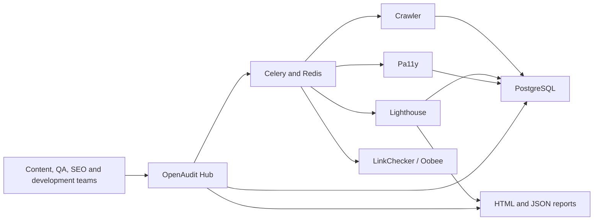
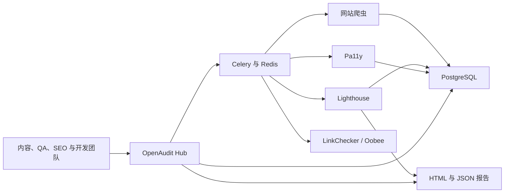

# OpenAudit Hub

**Open-source website governance for accessibility, SEO, quality assurance, and performance.**

**面向无障碍、SEO、质量保证与性能管理的开源网站治理平台。**

[English](#english) | [简体中文](#简体中文)

OpenAudit Hub combines proven open-source scanners with one operational dashboard. It is designed for teams that need a self-hosted, transparent alternative to commercial website-governance platforms such as Siteimprove.

OpenAudit Hub 将成熟的开源扫描工具整合到统一的管理平台中，适合需要自行部署、数据透明，并希望替代 Siteimprove 等商业网站治理平台的团队。

---

## English

### What OpenAudit does

- Manages multiple websites from one dashboard.
- Crawls sitemaps and same-domain internal links.
- Runs Lighthouse audits for performance, SEO, accessibility, and best practices.
- Runs Pa11y WCAG checks with selectors, HTML evidence, and practical remediation guidance.
- Detects broken links and keeps a page inventory.
- Tracks findings through open, assigned, in-progress, resolved, ignored, and reopened states.
- Schedules long-running scans with Celery and Redis instead of blocking web requests.
- Stores websites, scan jobs, crawl data, and issue history in PostgreSQL.
- Extracts content keywords with YAKE and optionally enriches them with Google Search Console CSV data.
- Retains native Lighthouse HTML/JSON reports and historical score trends.

### Open-source components

| Component | Purpose |
| --- | --- |
| OpenAudit Hub | Unified dashboard, website management, issues, guidance, and trends |
| Lighthouse / Lighthouse CI | Performance, SEO, accessibility, and best-practice audits |
| Pa11y / Pa11y Dashboard | WCAG accessibility testing and monitoring |
| Oobee (formerly Purple A11y) | Deep, crawl-based accessibility audits |
| LinkChecker | Broken-link validation |
| PostgreSQL | Operational and historical data |
| Redis + Celery | Background jobs and scheduled scans |
| YAKE | Local keyword extraction |
| Matomo / Mautic | Optional analytics and marketing integrations |

### Architecture



### Quick start

Requirements: Docker Desktop with Docker Compose and PowerShell on Windows.

1. Create your local configuration:

```powershell
Copy-Item .env.example .env
```

2. Replace the example passwords and tokens in `.env` before exposing the services beyond your computer.

3. Build and start the core platform:

```powershell
docker compose up -d --build postgres redis portal scan-worker scan-scheduler
```

4. Open the dashboard:

```text
http://localhost:9090
```

Optional standalone tools:

```powershell
docker compose up -d --build mongo pa11y-dashboard lhci-server lhci-scheduler
```

- Pa11y Dashboard: `http://localhost:4000`
- Lighthouse CI: `http://localhost:9001`

### Add websites and run scans

Use the web interface instead of editing configuration files:

1. Open `http://localhost:9090/websites`.
2. Add a website name and base URL.
3. Set its page limit, exclusions, schedule, and enabled state.
4. Open `http://localhost:9090/scans`.
5. Choose a website and scan mode, then start the scan.

Available modes:

- **Full audit:** crawl, Lighthouse, and Pa11y.
- **Accessibility:** crawl and Pa11y.
- **Lighthouse only:** crawl and Lighthouse.

The worker discovers sitemap and internal pages, stores the page inventory, runs the selected tools, merges repeated findings, and reconciles issue status without mixing results from different websites.

### Reports and operational views

| View | URL |
| --- | --- |
| Dashboard | `http://localhost:9090/` |
| Websites | `http://localhost:9090/websites` |
| Scans | `http://localhost:9090/scans` |
| Issues | `http://localhost:9090/modules/issues` |
| Crawled pages | `http://localhost:9090/modules/pages` |
| Broken links | `http://localhost:9090/modules/broken-links` |
| Keyword suggestions | `http://localhost:9090/modules/keyword-suggestions` |

Native Lighthouse HTML and JSON files are written to `outputs/reports/`. The dashboard uses the JSON reports to show latest scores, previous scores, category trends, and regressions.

### Keyword suggestions

YAKE extracts candidate phrases from titles, metadata, headings, body content, and image alternative text. This explains what a page currently targets; it does not provide real search volume or competition data by itself.

To add actual search performance, export Google Search Console query data and save it using the website key:

```text
config/search-console/gsc-example-com.csv
```

Recommended columns:

```text
Query, Page, Clicks, Impressions, CTR, Position
```

### Useful scripts

```powershell
# Generate a native Lighthouse HTML/JSON report
powershell -ExecutionPolicy Bypass -File .\scripts\run-lighthouse-report.ps1 -Url https://www.example.com/

# Run an audit and optionally include link checking
powershell -ExecutionPolicy Bypass -File .\scripts\run-audit.ps1 -Url https://www.example.com/ -IncludeLinks

# Run an Oobee deep accessibility scan
powershell -ExecutionPolicy Bypass -File .\scripts\run-oobee.ps1 -TargetUrl https://www.example.com/

# Run LinkChecker
powershell -ExecutionPolicy Bypass -File .\scripts\run-linkcheck.ps1 -TargetUrl https://www.example.com/
```

### Security and data

- `.env`, databases, generated reports, caches, and runtime files are excluded from Git.
- Public targets are enforced by default. Set `ALLOW_PRIVATE_TARGETS=true` only for trusted internal-site scanning.
- Change all example credentials before deployment.
- Put the application behind HTTPS and authentication before allowing internet access.
- Review scanner permissions and network access in production environments.

### Project structure

| Path | Contents |
| --- | --- |
| `services/portal` | Flask dashboard, APIs, templates, and migrations |
| `services/scan-worker` | Celery crawling and scanner pipeline |
| `services/lhci-*` | Lighthouse CI server, collector, and scheduler |
| `services/pa11y-dashboard` | Pa11y Dashboard image |
| `services/oobee` | Oobee deep scanner image |
| `config` | Scanner, URL, and optional connector configuration |
| `scripts` | PowerShell operational helpers |
| `outputs/reports` | Generated reports; contents are not committed |

### Current scope

OpenAudit already covers the core accessibility, SEO, performance, page inventory, broken-link, and issue-management workflow. Areas for future development include richer content-policy checks, PDF/Office auditing, enterprise authentication, multi-tenancy, live Search Console OAuth, and safe CMS-assisted remediation.

---

## 简体中文

### OpenAudit 能做什么

- 在一个管理后台中维护多个网站。
- 自动发现 Sitemap 和同域名内部链接。
- 使用 Lighthouse 检查性能、SEO、无障碍和最佳实践。
- 使用 Pa11y 执行 WCAG 检查，并提供选择器、HTML 证据和可执行的修复建议。
- 检测死链并维护完整的页面清单。
- 管理问题的开放、已分配、处理中、已解决、忽略和重新打开状态。
- 通过 Celery 和 Redis 在后台执行耗时扫描，避免网页请求卡死。
- 使用 PostgreSQL 保存网站、扫描任务、页面和问题历史。
- 使用 YAKE 提取页面关键词，并可导入 Google Search Console CSV 数据进行增强。
- 保留 Lighthouse 原生 HTML/JSON 报告，并展示历史分数趋势。

### 开源组件

| 组件 | 用途 |
| --- | --- |
| OpenAudit Hub | 统一仪表盘、网站管理、问题、修复指导和趋势 |
| Lighthouse / Lighthouse CI | 性能、SEO、无障碍和最佳实践审计 |
| Pa11y / Pa11y Dashboard | WCAG 无障碍检查与持续监控 |
| Oobee（原 Purple A11y） | 基于爬虫的深度无障碍审计 |
| LinkChecker | 死链验证 |
| PostgreSQL | 业务数据和历史数据存储 |
| Redis + Celery | 后台任务和定时扫描 |
| YAKE | 本地关键词提取 |
| Matomo / Mautic | 可选的数据分析与营销集成 |

### 架构



### 快速开始

运行环境：Docker Desktop、Docker Compose，以及 Windows PowerShell。

1. 创建本地配置：

```powershell
Copy-Item .env.example .env
```

2. 如果服务需要被其他电脑访问，请先修改 `.env` 中的示例密码和令牌。

3. 构建并启动核心平台：

```powershell
docker compose up -d --build postgres redis portal scan-worker scan-scheduler
```

4. 打开管理后台：

```text
http://localhost:9090
```

如需启动独立的 Pa11y Dashboard 和 Lighthouse CI：

```powershell
docker compose up -d --build mongo pa11y-dashboard lhci-server lhci-scheduler
```

- Pa11y Dashboard：`http://localhost:4000`
- Lighthouse CI：`http://localhost:9001`

### 添加网站并运行扫描

日常使用不需要手动修改配置文件：

1. 打开 `http://localhost:9090/websites`。
2. 添加网站名称和网站根地址。
3. 设置最大页面数、排除路径、扫描周期和启用状态。
4. 打开 `http://localhost:9090/scans`。
5. 选择网站和扫描模式，然后开始扫描。

扫描模式：

- **完整审计：** 爬取页面、运行 Lighthouse 和 Pa11y。
- **无障碍审计：** 爬取页面并运行 Pa11y。
- **仅 Lighthouse：** 爬取页面并运行 Lighthouse。

后台任务会发现网站页面、保存页面清单、运行对应工具、合并重复问题，并分别维护每个网站的问题状态，不会把不同网站的结果混在一起。

### 报告和管理页面

| 页面 | 地址 |
| --- | --- |
| 仪表盘 | `http://localhost:9090/` |
| 网站管理 | `http://localhost:9090/websites` |
| 扫描任务 | `http://localhost:9090/scans` |
| 问题中心 | `http://localhost:9090/modules/issues` |
| 页面清单 | `http://localhost:9090/modules/pages` |
| 死链检查 | `http://localhost:9090/modules/broken-links` |
| 关键词建议 | `http://localhost:9090/modules/keyword-suggestions` |

Lighthouse 原生 HTML 和 JSON 报告保存在 `outputs/reports/`。仪表盘会读取 JSON 报告，展示最新分数、上次分数、分类趋势和退步项目。

### 关键词建议

YAKE 会从标题、Meta 信息、页面标题、正文和图片替代文字中提取候选关键词。它能够分析页面当前在讲什么，但本身不提供真实搜索量或关键词竞争难度。

如需加入真实搜索表现，可从 Google Search Console 导出查询数据，并按照网站 Key 保存：

```text
config/search-console/gsc-example-com.csv
```

建议包含以下字段：

```text
Query, Page, Clicks, Impressions, CTR, Position
```

### 常用脚本

```powershell
# 生成 Lighthouse 原生 HTML/JSON 报告
powershell -ExecutionPolicy Bypass -File .\scripts\run-lighthouse-report.ps1 -Url https://www.example.com/

# 运行综合审计，并同时检查死链
powershell -ExecutionPolicy Bypass -File .\scripts\run-audit.ps1 -Url https://www.example.com/ -IncludeLinks

# 运行 Oobee 深度无障碍扫描
powershell -ExecutionPolicy Bypass -File .\scripts\run-oobee.ps1 -TargetUrl https://www.example.com/

# 运行 LinkChecker
powershell -ExecutionPolicy Bypass -File .\scripts\run-linkcheck.ps1 -TargetUrl https://www.example.com/
```

### 安全与数据

- `.env`、数据库、扫描报告、缓存和运行时文件不会上传到 Git。
- 默认只允许扫描公网目标；仅在可信内部环境中设置 `ALLOW_PRIVATE_TARGETS=true`。
- 正式部署前必须修改所有示例账号和密码。
- 如果允许互联网访问，请在应用前配置 HTTPS 和身份认证。
- 生产环境中应限制扫描容器的权限和网络访问范围。

### 项目目录

| 路径 | 内容 |
| --- | --- |
| `services/portal` | Flask 管理后台、API、模板和数据库迁移 |
| `services/scan-worker` | Celery 爬虫与扫描流水线 |
| `services/lhci-*` | Lighthouse CI 服务、采集器和调度器 |
| `services/pa11y-dashboard` | Pa11y Dashboard 镜像 |
| `services/oobee` | Oobee 深度扫描镜像 |
| `config` | 扫描器、URL 和可选连接器配置 |
| `scripts` | PowerShell 运维脚本 |
| `outputs/reports` | 生成的报告，内容不会提交到仓库 |

### 当前范围

OpenAudit 已经覆盖无障碍、SEO、性能、页面清单、死链和问题管理的核心工作流。后续还可以继续增加内容规范检查、PDF/Office 文档审计、企业身份认证、多租户、Search Console OAuth，以及安全的 CMS 辅助修复功能。

---

## Related projects / 相关项目

- [Lighthouse](https://github.com/GoogleChrome/lighthouse)
- [Lighthouse CI](https://github.com/GoogleChrome/lighthouse-ci)
- [Pa11y](https://github.com/pa11y/pa11y)
- [Pa11y Dashboard](https://github.com/pa11y/pa11y-dashboard)
- [Oobee](https://github.com/GovTechSG/purple-a11y)
- [LinkChecker](https://github.com/linkchecker/linkchecker)
- [YAKE](https://github.com/LIAAD/yake)

## License / 许可证

[MIT](LICENSE)
