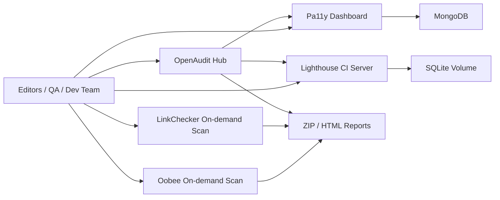

# OpenAudit Stack

一个完全开源、可容器化的“类 Siteimprove”基础方案，面向政府、教育、企业站点的持续质量巡检。

它不是单一产品的复刻，而是把几类顶级开源能力组合成一个统一的 Docker 项目：

- `Pa11y Dashboard`：持续无障碍巡检、历史结果、团队可视化
- `Lighthouse CI Server`：SEO、性能、最佳实践、Accessibility 趋势
- `Oobee`（原 Purple A11y）：全站深度爬取式无障碍审计
- `LinkChecker`：死链与可达性检查
- `OpenAudit Hub`：统一入口页，汇总导航、目标页面和最近报告

## 定位

这个仓库更像一套“开源审计平台底座”：

- 日常巡检：`Pa11y Dashboard`
- 质量评分与趋势：`Lighthouse CI`
- 深度整站审计：`Oobee`
- 补充链路检查：`LinkChecker`

如果你后续要补齐 Siteimprove 的“内容质量”和“拼写治理”，建议再接入：

- `Vale`：编辑规范、语气、拼写、术语一致性
- `write-good` / `textlint`：英文内容质量
- `LanguageTool`：多语言语法与拼写
- `Matomo` 或 `Plausible`：站点访问数据分析

## 架构



## 快速开始

1. 复制环境变量模板

```powershell
Copy-Item .env.example .env
```

2. 启动常驻服务

```powershell
docker compose up -d --build portal mongo pa11y-dashboard lhci-server lhci-scheduler
```

3. 打开界面

- OpenAudit Hub: `http://localhost:9090`
- Pa11y Dashboard: `http://localhost:4000`
- Lighthouse CI Server: `http://localhost:9001`
  - Default username: `admin`
  - Default password: `change-me`

## 常用命令

### 运行 Lighthouse 巡检并上传到 LHCI

先编辑 `config/lhci/urls.txt`，每行一个 URL。

也可以用脚本切换目标网站：

```powershell
powershell -ExecutionPolicy Bypass -File .\scripts\set-target.ps1 -Url https://www.example.com/
```

如果你第一次打开 `http://localhost:9001` 只看到欢迎页，先初始化一个 LHCI 项目：

```powershell
.\scripts\init-lhci.ps1
```

```powershell
.\scripts\run-lighthouse.ps1
```

### 自动定时 Lighthouse

`lhci-scheduler` 会按 `.env` 中的 `LHCI_SCHEDULE_INTERVAL_MINUTES` 自动运行 Lighthouse，默认每 1440 分钟一次，并在启动时立刻跑一次。

```powershell
docker compose up -d --build lhci-scheduler
```

### 运行 Oobee 深度扫描

```powershell
.\scripts\run-oobee.ps1 -TargetUrl https://www.example.gov.au
```

结果会输出到 `outputs/reports/`。

### 运行死链检查

```powershell
.\scripts\run-linkcheck.ps1 -TargetUrl https://www.example.gov.au
```

## 目录说明

- `services/pa11y-dashboard`：Pa11y Dashboard 镜像
- `services/lhci-server`：Lighthouse CI Server 镜像
- `services/lhci-collector`：Lighthouse 采集与上传工具
- `services/oobee`：Oobee 深度扫描镜像
- `services/portal`：统一门户首页
- `config/`：URL、排除规则与扫描配置
- `scripts/`：Windows 友好的执行脚本
- `outputs/reports/`：扫描导出结果

## 当前版本的边界

这个基础版已经覆盖 Siteimprove 最核心的“无障碍 + SEO/性能 + 死链”能力，但还没有把以下能力统一到一个单独 UI 中：

- 内容拼写与风格质量
- PDF/Office 文档内容治理面板
- 统一权限与多租户
- 单一报表中心
- 业务分析看板

如果你愿意，我下一步可以继续把它做成一个更像成品的平台，例如：

1. 增加一个统一前台 Web 门户，把所有扫描结果汇总到一个首页
2. 增加 `Vale + LanguageTool` 内容质量检查
3. 增加调度器，实现每周自动跑 `Oobee` 和 `LinkChecker`
4. 增加报告导出页，做成给客户或管理层看的审计中心

## 参考项目

- [Pa11y Dashboard](https://github.com/pa11y/pa11y-dashboard)
- [Lighthouse CI](https://github.com/GoogleChrome/lighthouse-ci)
- [Oobee / Purple A11y](https://github.com/GovTechSG/purple-a11y)
- [LinkChecker](https://github.com/linkchecker/linkchecker)

## Google Lighthouse 完整报告

如果你想要 [GoogleChrome/lighthouse](https://github.com/GoogleChrome/lighthouse) 原生的完整 HTML/JSON 报告，而不是只看 Lighthouse CI 的趋势面板，可以直接运行：

```powershell
powershell -ExecutionPolicy Bypass -File .\scripts\run-lighthouse-report.ps1 -Url https://www.example.com/
```

生成的 `.html` 和 `.json` 会放到 `outputs/reports/`，并显示在 OpenAudit Hub 的 Recent generated reports 区域。

如果要一次跑多个页面：

```powershell
powershell -ExecutionPolicy Bypass -File .\scripts\run-lighthouse-report.ps1 -Url https://www.example.com/,https://www.example.com/about
```

`run-lighthouse.ps1` 也支持同样的 `-Url` 参数，用于把分数上传到 Lighthouse CI 做历史趋势。

## 一键审计一个网站

如果你不想分别运行 Lighthouse 报告和 Lighthouse CI，可以用这个入口：

```powershell
powershell -ExecutionPolicy Bypass -File .\scripts\run-audit.ps1 -Url https://www.example.com/
```

它会自动更新目标网址、生成 Google Lighthouse 原生 HTML/JSON 报告，并在已配置 `LHCI_BUILD_TOKEN` 时上传到 Lighthouse CI。

如果还想顺便检查死链：

```powershell
powershell -ExecutionPolicy Bypass -File .\scripts\run-audit.ps1 -Url https://www.example.com/ -IncludeLinks
```

## Sitemap crawler

OpenAudit can now fetch XML sitemaps for every website listed in `config/lhci/urls.txt` and save JSON reports to `outputs/reports/`.

Run all configured websites:

```powershell
powershell -ExecutionPolicy Bypass -File .\scripts\crawl-sitemaps.ps1
```

Run one website only:

```powershell
powershell -ExecutionPolicy Bypass -File .\scripts\crawl-sitemaps.ps1 -Url https://www.example.com/ -Limit 500
```

Review the result in `http://localhost:9090/modules/sitemaps`.

## Batch broken-link checks

Run LinkChecker for every website listed in `config/lhci/urls.txt`:

```powershell
powershell -ExecutionPolicy Bypass -File .\scripts\run-linkcheck.ps1
```

Run one website only:

```powershell
powershell -ExecutionPolicy Bypass -File .\scripts\run-linkcheck.ps1 -TargetUrl https://www.example.com/
```

Reports are saved to `outputs/reports/` with site-specific names such as `linkcheck-example-com-20260616-120000.txt`, and the Hub shows counts under `http://localhost:9090/modules/broken-links`.

## Keyword suggestions

OpenAudit Hub uses a layered keyword suggestion approach:

- YAKE extracts candidate keywords from live page content: title, meta description, headings, paragraphs, and image alt text.
- Sitemap data maps keyword ideas back to landing pages.
- Lighthouse SEO issues are used to estimate priority, difficulty, and points you can gain.

After changing portal dependencies or keyword logic, rebuild the portal image:

```powershell
docker compose up -d --build portal
```

Then open:

```text
http://localhost:9090/modules/keyword-suggestions
```

Google Search Console can be connected later to add real query data such as impressions, clicks, CTR, and average position.

### Import Google Search Console CSV

You can enrich Keyword suggestions before building a full OAuth connector.

1. Open Google Search Console Performance.
2. Export a CSV that includes query data. Page-level exports are better when available.
3. Save the file with the site key in the filename:

```text
config/search-console/gsc-truvisionled-com-au.csv
```

Recommended columns:

```text
Query, Page, Clicks, Impressions, CTR, Position
```

Open the module again:

```text
http://localhost:9090/modules/keyword-suggestions?site=truvisionled-com-au
```

The Search Console insights table will show imported queries and the keyword recommendations will use clicks, impressions, CTR, and position where a matching query is found.

## Audit history and trends

OpenAudit Hub now builds a lightweight trend layer from generated Lighthouse JSON reports.

Open the dashboard to see latest score, previous score, score delta, category trends, and recent crawl regressions:

```text
http://localhost:9090/?site=truvisionled-com-au
```

The dashboard also compares the latest crawl with the previous crawl and shows new issues, resolved issues, and the number of open issues in each historical snapshot. The first crawl for a website is treated as the baseline.

The dashboard Activity plan exposes the highest-impact fixes with owner, priority, timing, next step, and validation guidance:

```text
http://localhost:9090/api/action-plan?site=truvisionled-com-au
```

Structured history is also available from:

```text
http://localhost:9090/api/history?site=truvisionled-com-au
```

Export trend data:

```text
http://localhost:9090/api/history/export.csv?site=truvisionled-com-au
```

Run Lighthouse repeatedly for the same website to populate meaningful trend comparisons.

## Website database and background scans

OpenAudit now uses PostgreSQL as the primary source for managed websites, scan jobs, and issue lifecycle records. Redis and Celery run Lighthouse outside the Flask request so the dashboard does not block during long audits.

On first startup, existing URLs from `config/lhci/urls.txt` are imported into the `websites` table. After migration, manage the active list from:

```text
http://localhost:9090/websites
```

Start or monitor scans from:

```text
http://localhost:9090/scans
```

Build and start the new services:

```powershell
docker compose up -d --build postgres redis portal scan-worker scan-scheduler
```

The scan worker writes Lighthouse HTML/JSON files into `outputs/reports`, updates progress in PostgreSQL, and reconciles issue state for the selected website.

Core management APIs:

```text
GET/POST    /api/websites
GET/PATCH/DELETE /api/websites/{website-key}
GET/POST    /api/scans
GET         /api/scans/{job-id}
GET         /api/lifecycle/issues?site={website-key}
PATCH       /api/lifecycle/issues/{issue-id}
```

Issue lifecycle states are `open`, `assigned`, `in_progress`, `resolved`, `ignored`, and `reopened`. Re-scanning automatically resolves findings that disappear and reopens resolved findings that return, while preserving manually assigned, in-progress, and ignored records.

### Database migrations

The Portal runs `alembic upgrade head` before Flask starts. Migration files live in `services/portal/migrations/versions` and must be committed whenever the operational schema changes.

To inspect the current migration inside the container:

```powershell
docker compose exec portal alembic -c /app/alembic.ini current
```

### Unified scan pipeline

Each background scan now performs these stages:

1. Discover `/sitemap.xml` and same-domain internal links.
2. Apply the website maximum-page and excluded-path settings.
3. Save URL, title, HTTP status, crawl depth, source, content type, and errors in `crawl_pages`.
4. Run Lighthouse on representative pages, beginning with the homepage and shallow pages.
5. Run Pa11y WCAG checks across the configured accessibility page limit.
6. Merge repeated findings across pages and save URL, selector, HTML snippet, and explanation evidence.
7. Reconcile open, resolved, ignored, and reopened issue lifecycle records independently for each scanner.

Useful worker settings:

```text
LIGHTHOUSE_PAGE_LIMIT=3
CRAWL_MAX_DEPTH=3
SCHEDULE_CHECK_SECONDS=300
PA11Y_PAGE_LIMIT=20
PA11Y_STANDARD=WCAG2AA
PA11Y_TIMEOUT_MS=60000
```

Scan modes available at `http://localhost:9090/scans`:

- `Full audit`: page discovery, Lighthouse, and Pa11y.
- `Accessibility (Pa11y)`: page discovery and Pa11y only.
- `Lighthouse only`: page discovery and Lighthouse only.

Pa11y findings appear directly in the OpenAudit Issues page with their affected URL, selector, HTML context, status, and owner. The separate Pa11y Dashboard remains optional rather than being required to start scans.

The `scan-scheduler` Celery Beat service checks Daily, Weekly, and Monthly website schedules. It will not queue another scan while the website already has a queued or running job.

Full crawl inventory is available from:

```text
http://localhost:9090/modules/pages?site=truvisionled-com-au
http://localhost:9090/api/crawl-pages?site=truvisionled-com-au
```
